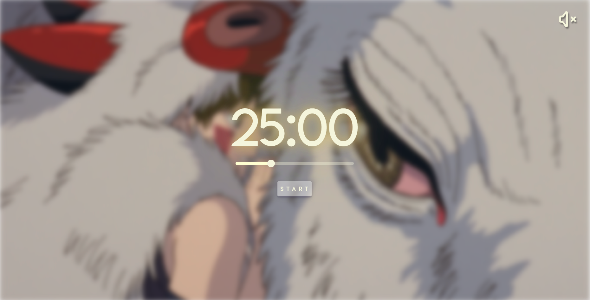

# Focus With Ghibli
A pomodoro timer to focusing while you get immersive while you see and hear some art from Studio Ghibli.

## [Live Preview](https://focuswithghibli.com/) ⚡

## Stack used
- Vite
- React
- Netlify

### Playlists used in this app
https://www.youtube.com/watch?v=Sx4xVyXHl60
https://www.youtube.com/watch?v=eWVv_rM8pEk
https://www.youtube.com/watch?v=UJf33lZhCZc
https://www.youtube.com/watch?v=MHb1m9pInEg
https://www.youtube.com/watch?v=HTzRSQt7pdY

## Disclaimer

This web app contains content, including images and music, that is the intellectual property of Studio Ghibli. All rights for the original content belong to Studio Ghibli and its respective creators.

## Attribution

- **Images:** The images used in this web app are sourced from Studio Ghibli movies and are the property of Studio Ghibli.
- **Music:** The music tracks featured in this web app are from Studio Ghibli movies and are the original work of Studio Ghibli's composers.

## Usage Disclaimer

This web app is created for educational and non-commercial purposes only. It is not endorsed by or affiliated with Studio Ghibli.

Please make sure to comply with Studio Ghibli's terms of use and licensing when using and distributing this web app.

## Acknowledgment

Special thanks to Studio Ghibli for creating the beautiful content that inspired this web app.
